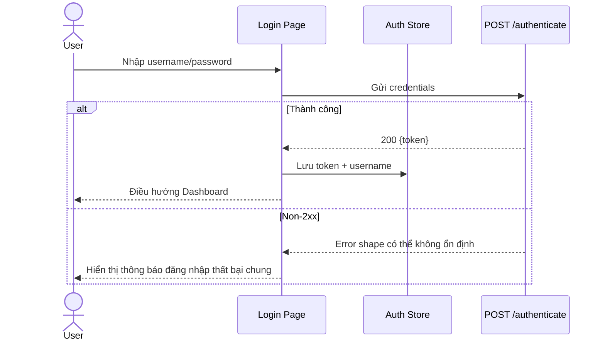
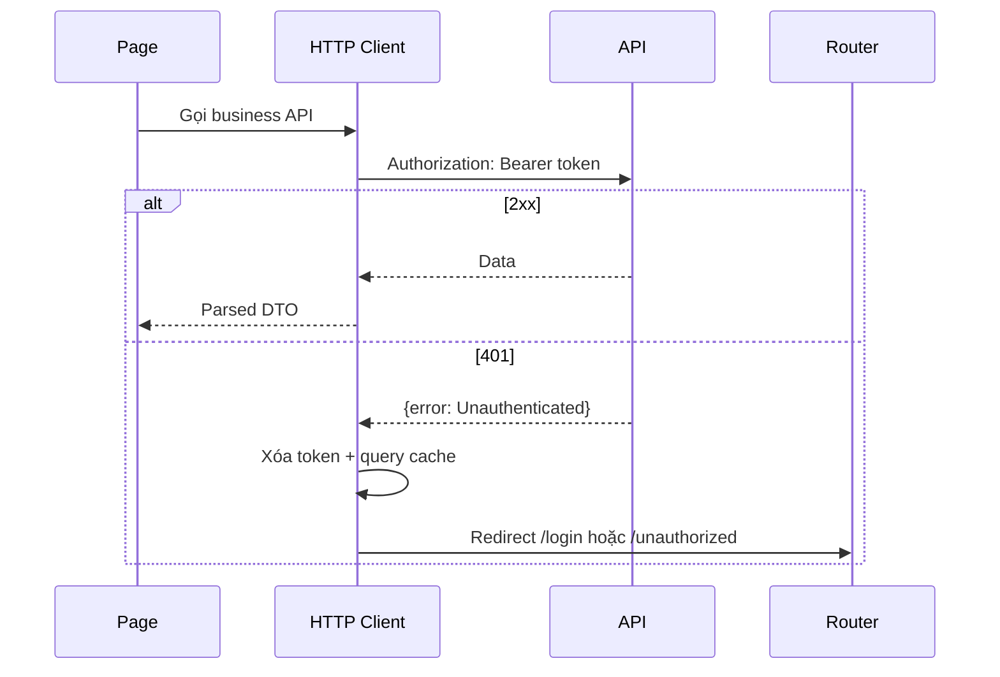

# Authentication Journey

**Trạng thái:** Backend-aligned flow + proposed frontend handling

## 1. Đăng nhập

## 2. Protected request

## 3. Route guard

- Public: `/login`.
- Protected: mọi route `/app/*`.
- Không có token: redirect Login trước khi mount page.
- Có token: cho phép route, nhưng request đầu tiên vẫn có thể trả 401.
- Có thể đọc `exp` từ JWT để logout sớm cho UX, nhưng không dùng payload JWT như authorization source.

## 4. Token storage đề xuất cho demo

- runtime source: Pinia/in-memory;
- reload persistence: `sessionStorage`;
- không dùng `localStorage` mặc định;
- không log hoặc đưa token vào URL;
- xóa token khi logout, 401 hoặc decode thấy hết hạn.

## 5. Logout

Backend không có logout endpoint. Nút Logout:

1. xóa token và username;
2. clear query cache;
3. điều hướng Login.

Token cũ vẫn có thể hoạt động đến lúc hết hạn nếu bị sao chép; đây là ràng buộc backend.

## 6. Greeting

Vì không có `/me`, dòng “Xin chào, username” lấy từ:

1. username vừa đăng nhập; hoặc
2. JWT subject được decode chỉ để hiển thị.
