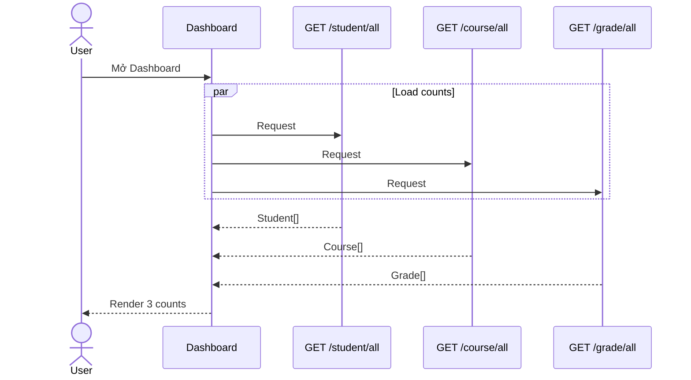

# Dashboard Journey

**Trạng thái:** Frontend aggregation supported; activity feed gap

## 1. Tải dashboard



## 2. Partial failure

Mỗi card có trạng thái độc lập:

- loading;
- loaded count;
- error + retry;
- không biến lỗi một endpoint thành lỗi toàn trang.

## 3. Cache

Dùng cùng query keys với các feature list:

```text
['students']
['courses']
['grades']
```

Dashboard tận dụng cache thay vì tạo nguồn dữ liệu thứ hai.

## 4. Recent Activities

Backend không có:

- audit columns;
- activity/event endpoint;
- log API dành cho frontend.

MVP tích hợp phải:

- ẩn section; hoặc
- hiển thị empty state “Chưa hỗ trợ dữ liệu hoạt động gần đây”.

Không dùng dữ liệu mẫu như dữ liệu thật.
