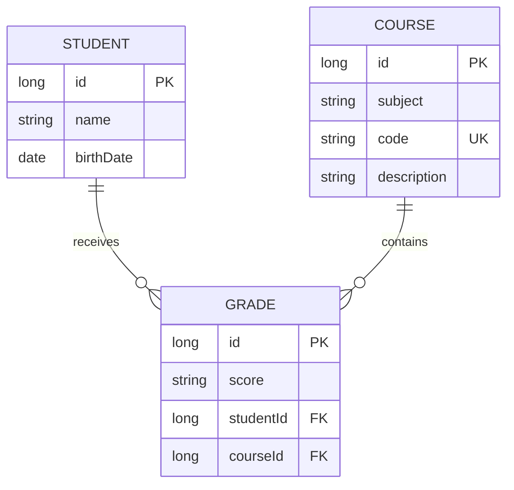

# Data Model cho frontend

**Trạng thái:** Backend-aligned logical model

## 1. Entity relationship



Một cặp `(studentId, courseId)` chỉ có tối đa một Grade.

## 2. API DTO

```ts
export interface StudentDto {
  id: number;
  name: string;
  birthDate: string; // yyyy-MM-dd
}

export interface CourseDto {
  id: number;
  subject: string;
  code: string;
  description: string;
}

export interface GradeDto {
  id: number;
  score: string;
  student: StudentDto;
  course: CourseDto;
}
```

Grade response chứa nested Student và Course.

## 3. UI view models

Không bind trực tiếp DTO vào mọi component. Adapter chịu trách nhiệm:

- `CourseDto.subject` → `CourseViewModel.courseName`;
- `StudentDto.birthDate` → label ngày hiển thị;
- flatten nested Grade để render bảng.

```ts
export interface GradeRow {
  id: number;
  studentId: number;
  studentName: string;
  courseId: number;
  courseCode: string;
  courseName: string;
  score: string;
}
```

## 4. Data lifecycle

```text
Backend restart
    → H2 data bị xóa
    → seed 4 Student + 6 Course chạy lại
    → ID có thể được tạo lại
```

Không dùng seed ID như dữ liệu định danh bền vững ở frontend.

## 5. Delete relationship

Student và Course có cascade tới Grade trong mapping hiện tại. UI phải cảnh báo rằng xóa parent có thể ảnh hưởng các Grade liên quan, nhưng cần integration test trước khi coi chi tiết này là business contract ổn định.

## 6. Khoảng trống

- không có audit timestamp;
- không có version/ETag;
- không có soft delete;
- không có user/account entity;
- không có grade scale;
- không có DTO boundary đầy đủ ở backend.
