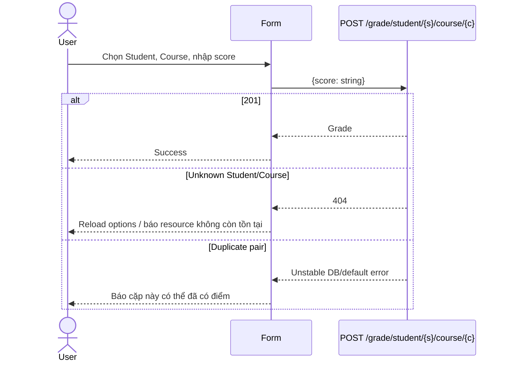

# Grade Journey

**Trạng thái:** Backend-supported

## 1. Danh sách và lọc

| Filter | Endpoint đề xuất |
|---|---|
| Không chọn gì | `GET /grade/all` |
| Chỉ Student | `GET /grade/student/{studentId}` |
| Chỉ Course | `GET /grade/course/{courseId}` |
| Student + Course | `GET /grade/student/{studentId}/course/{courseId}` |

Pair không tồn tại trả 404; UI nên chuyển thành empty result trong ngữ cảnh filter, nhưng vẫn giữ 404 ở trang grade detail.

## 2. Tạo Grade



## 3. Cập nhật Grade

```http
PUT /grade/student/{studentId}/course/{courseId}
Content-Type: application/json

{"score":"B+"}
```

Student và Course của Grade không thay đổi qua update này. Nếu cần đổi pair, phải xóa Grade cũ và tạo mới bằng thao tác người dùng rõ ràng; không thực hiện ngầm.

## 4. Score semantics

- `score` là `String`;
- `A`, `B+`, `Pass`, `85`, `8.5` đều là representation có thể gửi về mặt contract hiện tại;
- không dùng number input;
- không parse, round hoặc calculate trên client;
- chỉ trim và kiểm tra non-empty trong MVP.

## 5. Delete

`DELETE /grade/student/{studentId}/course/{courseId}` trả `204` ở success path. Delete pair không tồn tại có thể vẫn là no-op + 204.

## 6. Cache invalidation

Sau create/update/delete, invalidate:

```text
grades-all
grades-by-student:{studentId}
grades-by-course:{courseId}
grade-pair:{studentId}:{courseId}
students/courses dashboard counts khi cần
```
