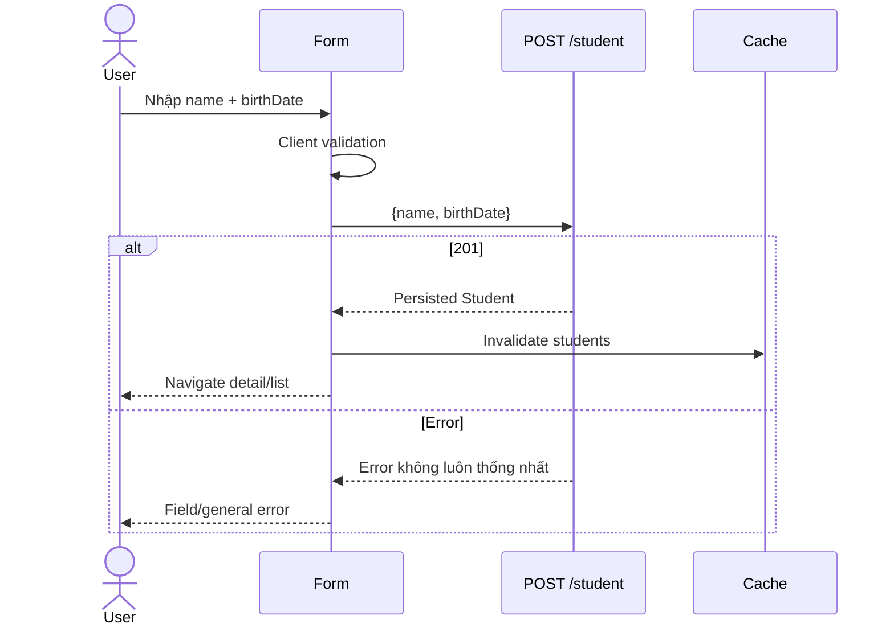
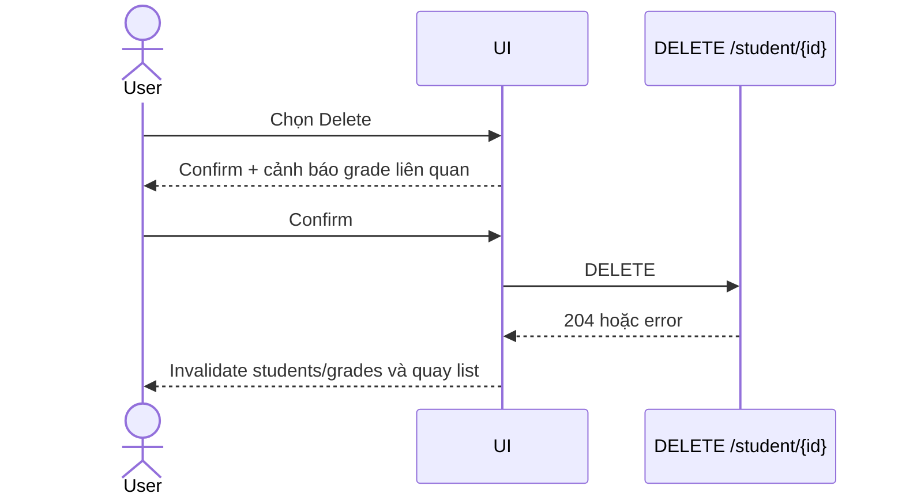

# Student Journey

**Trạng thái:** Create/read/list/delete supported; update gap

## 1. Danh sách

1. gọi `GET /student/all`;
2. map `birthDate` thành label hiển thị;
3. search theo ID hoặc tên tại client;
4. phân trang tại client;
5. lưu search/page trong URL query.

Canonical columns:

```text
ID | Student Name | Birth Date | Actions
```

## 2. Tạo Student



API date dùng `yyyy-MM-dd`. Input `type=date` phù hợp với contract.

## 3. Chi tiết Student

Tải song song:

- `GET /student/{id}`;
- `GET /grade/student/{id}`.

Grade response chứa Course nested, nên có thể render bảng “Enrolled Courses & Grades” mà không cần gọi từng Course.

## 4. Edit

Backend không có PUT/PATCH Student. MVP:

- không tạo route edit thật;
- ẩn hoặc disable nút Edit;
- có thể gắn tooltip “Backend chưa hỗ trợ cập nhật sinh viên”.

## 5. Delete



Delete ID không tồn tại chưa có behavior ổn định. Xóa Student có thể cascade Grade theo mapping hiện tại.
