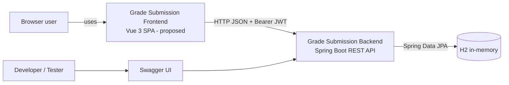

# System Context

**Trạng thái:** Backend-aligned boundary + proposed frontend  
**Cập nhật lần cuối:** 2026-07-22

## 1. Mục tiêu

Grade Submission Frontend cung cấp giao diện web cho người dùng:

- đăng nhập bằng tài khoản demo;
- xem tổng quan số lượng sinh viên, khóa học và điểm;
- quản lý sinh viên;
- quản lý khóa học;
- tạo, xem, lọc, cập nhật và xóa điểm.

## 2. Actor

### Guest

- truy cập màn hình đăng nhập;
- gửi `POST /authenticate`;
- không được truy cập route nghiệp vụ.

### Authenticated user

- có JWT hợp lệ;
- có thể gọi toàn bộ Student, Course và Grade API;
- backend hiện không có role/permission, nên mọi JWT hợp lệ có cùng quyền.

### Developer / Tester

- chạy backend tại `http://localhost:9090`;
- dùng Swagger UI tại `/swagger-ui/index.html`;
- dùng tài khoản demo `username` / `password`;
- kiểm tra dữ liệu H2 và các luồng E2E.

## 3. Boundary rules

- Frontend không truy cập H2 trực tiếp.
- Frontend không được giả lập endpoint update Student/Course bằng chuỗi delete + create.
- Token ở client chỉ là credential để gọi API; backend là nơi quyết định request có được xác thực hay không.
- Search, sort và pagination trong MVP là khả năng phía client trên dữ liệu `/all`, không phải contract server-side.
- Recent Activities trong wireframe không có nguồn backend hiện tại.
- Dữ liệu có thể bị reset khi backend restart vì H2 in-memory.
- Việc chạy frontend khác origin cần dev proxy, same-origin deployment hoặc backend CORS policy phù hợp.

## 4. Dependency hiện tại

| Dependency | Vai trò | Trạng thái |
|---|---|---|
| Spring Boot Backend | Authentication và CRUD API | Có |
| H2 in-memory | Lưu Student/Course/Grade | Có, không bền vững |
| Swagger/OpenAPI | Khám phá API | Có |
| Vue 3 + TypeScript | Framework frontend | Đề xuất |
| Vue Router | Route và auth boundary | Đề xuất |
| Pinia | Auth/UI state | Đề xuất |
| TanStack Vue Query | Server-state cache | Đề xuất |
