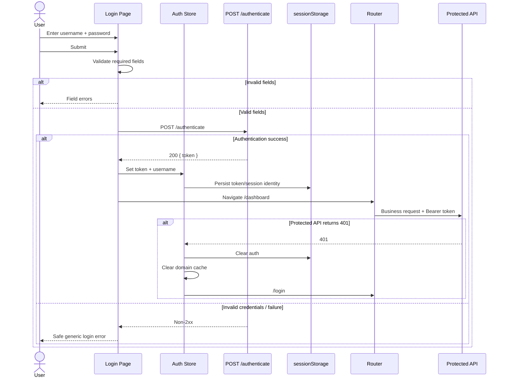

# Login — Spec Pack

**Phụ trách:** Frontend team  
**Trạng thái:** Target implementation / Backend-aligned / Design-aligned  
**Cập nhật lần cuối:** 2026-09-14

---

## 1. Bối cảnh

Màn hình **Login** là public authentication surface của Grade Submission System. Mục đích của màn hình là cho phép faculty/staff đăng nhập bằng username/password, nhận JWT từ backend, tạo authenticated session phía frontend và điều hướng vào khu vực nghiệp vụ của ứng dụng.

Spec pack này được xây dựng dựa trên:

- design `docs/ui/web/grade_submission/screens/design/auth.png`;
- screen spec `docs/ui/web/grade_submission/screens/auth/auth_login.md`;
- auth module docs;
- authentication journey;
- security standards;
- E2E auth scenarios;
- API contract hiện có;
- source code hiện tại.

### 1.1 Current implementation

Source hiện tại **chưa có màn hình Login hoàn chỉnh**.

Đã có:

- `src/core/auth/token-storage.ts`
  - đọc access token từ `sessionStorage`;
  - xóa access token khỏi `sessionStorage`;
- các docs mô tả auth flow và backend contract.

Chưa thấy implementation tương ứng cho:

- route `/login`;
- `LoginPage.vue`;
- login form;
- auth store;
- action lưu token sau login;
- lưu username/session display identity;
- route guard;
- global `401` cleanup;
- logout action đầy đủ;
- password visibility toggle;
- redirect authenticated user ra khỏi `/login`.

### 1.2 Target

Target là màn hình Login hoàn chỉnh theo `auth.png`, tích hợp:

```http
POST /authenticate
```

và tạo session phía frontend bằng JWT.

---

## 2. Source và boundary

### 2.1 Design source

Primary design:

```text
docs/ui/web/grade_submission/screens/design/auth.png
```

Supporting screen documentation:

```text
docs/ui/web/grade_submission/screens/auth/auth_login.md
```

### 2.2 Architecture/documentation source

```text
docs/modules/auth/spec.md
docs/modules/auth/test_spec.md
docs/modules/auth/tasks.md
docs/architecture/authentication_journey.md
docs/architecture/requirements.md
docs/security.md
docs/standards/security-architecture.md
docs/standards/api-integration.md
docs/e2e/auth.md
docs/spec.md
```

### 2.3 Current source evidence

```text
src/core/auth/token-storage.ts
src/app/router/routes.ts
```

### 2.4 Backend endpoint

```http
POST /authenticate
Content-Type: application/json
```

Request:

```json
{
  "username": "username",
  "password": "password"
}
```

Success:

```json
{
  "token": "<jwt>"
}
```

### 2.5 Route

Target public route:

```text
/login
```

Access:

```text
Public
```

Expected route behavior:

```text
Unauthenticated user
/login
   ↓
Login page
```

```text
Authenticated user
/login
   ↓
redirect /dashboard
```

### 2.6 Protected application boundary

Sau khi login thành công:

```text
/login
  ↓ POST /authenticate
JWT
  ↓
Auth state
  ↓
/dashboard
```

Mọi business route phải được coi là protected, bao gồm tối thiểu:

```text
/dashboard
/students
/students/new
/students/:id
/courses
/courses/new
/courses/:id
/grades
```

### 2.7 Current / Target / Backlog

| Capability | Current | Target | Backlog / Out of scope |
| --- | --- | --- | --- |
| `/login` route | Chưa có | Public login route | — |
| Login UI | Chưa có | Theo `auth.png` | — |
| Username/password form | Chưa có | Có | — |
| Password visibility toggle | Chưa có | Có | — |
| `POST /authenticate` | Chưa thấy UI integration | Có | — |
| JWT storage | Partial helper | Memory + `sessionStorage` | HttpOnly/BFF cần backend change |
| Username session | Chưa có | Memory + session persistence phù hợp | `/me` API chưa có |
| Route guard | Chưa thấy | Có | RBAC chưa có |
| Global 401 handling | Chưa thấy | Có | Refresh token chưa có |
| Logout | Chưa thấy | Client-side cleanup | Server revoke/logout chưa có |
| Registration | Không có | Không implement | Backlog nếu backend hỗ trợ |
| Remember me | Không có | Không implement | Backlog |
| Forgot password | Không có | Không implement | Backlog |
| Role/permission | Không có | Không render | Backlog |

---

## 3. Phạm vi

### 3.1 In scope

Spec này bao gồm:

- Login page layout.
- Username input.
- Password input.
- Show/hide password.
- Required validation.
- Login submission.
- Submit pending state.
- Authentication success.
- Invalid credentials handling.
- Network/server error handling.
- JWT storage cho demo frontend.
- Username/session identity handling.
- Redirect sau login.
- Redirect authenticated user khỏi Login.
- Route guard dependency.
- Global 401 session cleanup dependency.
- Logout/session cleanup contract liên quan.
- Demo account notice.
- Security notice.
- Keyboard behavior.
- Accessibility.
- Responsive layout.
- Acceptance criteria.
- Suggested test coverage.

### 3.2 Out of scope

Không implement trong màn hình này:

- Registration.
- Forgot password.
- Change password.
- Multi-factor authentication.
- Social login.
- Refresh token.
- Server-side logout.
- Token revocation.
- Persistent `Remember me`.
- Role/permission/RBAC.
- User profile API.
- `/me` endpoint.
- Captcha.
- Account lockout UI trừ khi backend bổ sung contract.
- Password complexity validation phía Login.
- Client-side validation username/password existence ngoài required rule.

---

## 4. Target UI

### 4.1 Desktop composition

Design mục tiêu:

```text
┌─────────────────────────────────────────────────────────────────────────────┐
│                                                                             │
│  [Book] GRADE SUBMISSION SYSTEM                                             │
│         Learning Management System                                          │
│                                                                             │
│                                                                             │
│       Submit grades more                   ┌─────────────────────────────┐   │
│       accurately and more securely.        │           [Lock]            │   │
│                                            │                             │   │
│       A safe and reliable system that      │            Login            │   │
│       faculty and staff can use with       │            Login            │   │
│       confidence.                          │                             │   │
│                                            │ Username                    │   │
│                                            │ [user] Enter your username  │   │
│                                            │                             │   │
│                                            │ Password                    │   │
│                                            │ [lock] ********      [eye]  │   │
│                                            │                             │   │
│                                            │ [          Login          ] │   │
│                                            │                             │   │
│                                            │ (i) Demo account:           │   │
│                                            │     username / password     │   │
│                                            │                             │   │
│                                            │ ─────────────────────────── │   │
│                                            │ [lock] Authorized staff only│   │
│                                            └─────────────────────────────┘   │
│                                                                             │
└─────────────────────────────────────────────────────────────────────────────┘
```

### 4.2 Main UI blocks

```text
LoginPage
├── Brand / product introduction
│   ├── Grade Submission System
│   ├── Learning Management System
│   ├── Headline
│   └── Supporting copy
│
└── LoginCard
    ├── Lock icon
    ├── Title: Login
    ├── Section indicator/subtitle
    ├── LoginForm
    │   ├── Username field
    │   ├── Password field
    │   │   └── visibility toggle
    │   └── Login button
    ├── Form / API error
    ├── Demo account notice
    ├── Divider
    └── Authorized access notice
```

### 4.3 Copy

Primary visible copy should follow design:

```text
GRADE SUBMISSION SYSTEM
Learning Management System

Submit grades more
accurately and more securely.

A safe and reliable system that faculty
and staff can use with confidence.

Login

Username
Enter your username

Password
Enter your password

Login

Demo account: username / password

Access restricted to authorized faculty and staff only
```

Error copy is defined separately in error states.

---

## 5. Data contract

### 5.1 Login form model

Recommended view model:

```ts
interface LoginFormModel {
  username: string
  password: string
}
```

### 5.2 Authenticate request DTO

```ts
interface AuthenticateRequest {
  username: string
  password: string
}
```

Serialized request:

```json
{
  "username": "username",
  "password": "password"
}
```

### 5.3 Authenticate response DTO

```ts
interface AuthenticateResponse {
  token: string
}
```

Expected successful response:

```json
{
  "token": "<non-empty-jwt>"
}
```

### 5.4 Auth state

Recommended frontend state boundary:

```ts
interface AuthState {
  accessToken: string | null
  username: string | null
  status: 'anonymous' | 'authenticated'
}
```

Do **not** store:

```ts
password
```

in global application state.

### 5.5 Storage

Current docs define demo persistence as:

```text
Runtime:
memory / auth store

Refresh persistence:
sessionStorage
```

Token storage key already present:

```ts
grade-submission.auth.token
```

Username may use a dedicated key if required:

```ts
grade-submission.auth.username
```

or be reconstructed from safe session state/JWT subject according to implementation plan.

Constraints:

- không dùng `localStorage` mặc định;
- không persist password;
- không đưa JWT vào URL;
- không log JWT;
- không log password;
- clear auth storage khi logout hoặc backend trả `401`.

### 5.6 JWT usage

Business request:

```http
Authorization: Bearer <token>
```

Authentication request:

```http
POST /authenticate
```

must **not** send an Authorization Bearer header unless a future backend contract explicitly requires it.

---

## 6. Form behavior

### 6.1 Username

Properties:

```text
type: text
required: true
autocomplete: username
```

Recommended behavior:

- bind to local form state;
- trim leading/trailing whitespace for validation and request;
- do not lowercase automatically unless backend explicitly makes usernames case-insensitive;
- preserve user input while correcting validation errors;
- maximum length should not be invented without backend/domain rule.

Placeholder:

```text
Enter your username
```

### 6.2 Password

Properties:

```text
type: password by default
required: true
autocomplete: current-password
```

Placeholder:

```text
Enter your password
```

Password handling:

- do not trim/mutate password automatically;
- do not persist;
- do not log;
- do not include in analytics;
- do not expose in route/query params.

### 6.3 Password visibility toggle

Default:

```text
password masked
```

When user activates eye control:

```text
type=password
↓
type=text
```

Second activation:

```text
type=text
↓
type=password
```

Requirements:

- toggle must not modify password value;
- toggle must be keyboard accessible;
- button must expose accessible state/name such as:
  - `Show password`;
  - `Hide password`;
- the control must be `type="button"` so it does not submit the form.

### 6.4 Enter key

When focus is inside Username or Password:

```text
Enter
→ form submit
```

provided the form is not already submitting.

### 6.5 Login button

Default:

```text
enabled
```

unless project convention chooses to disable for invalid required fields.

Authoritative validation behavior:

- clicking Login with missing required data must show errors;
- no authentication request should be sent.

Submitting:

```text
Login button disabled
```

The UI may show:

```text
Logging in...
```

or loading spinner while preserving button width.

Double-click / repeated Enter must not produce duplicate concurrent login requests.

---

## 7. Validation

### 7.1 Username required

Invalid when:

```ts
username.trim().length === 0
```

Suggested message:

```text
Username is required.
```

### 7.2 Password required

Invalid when:

```ts
password.length === 0
```

Suggested message:

```text
Password is required.
```

Do not apply trim to password.

### 7.3 Submit validation order

On submit:

1. validate username;
2. validate password;
3. display all relevant field errors;
4. focus first invalid field;
5. do not call API when validation fails.

### 7.4 Error clearing

When user edits an invalid field:

- field-level validation error may clear when valid;
- server auth error should clear when the user changes credentials or submits again.

### 7.5 No invented credential rules

Do not add client rules such as:

```text
minimum 8 characters
must contain uppercase
must contain number
```

because Login validates existing credentials, not password creation, and no such backend contract is defined.

---

## 8. Normal flow

### 8.1 Open Login unauthenticated

```text
User → /login
```

Expected:

- Login page renders.
- Username empty.
- Password empty.
- Password masked.
- No previous password is restored.
- Login form is interactive.
- Demo account notice appears only where demo environment policy allows.

### 8.2 Submit valid credentials

```text
User
  ↓
Enter username/password
  ↓
Submit
  ↓
Validate required fields
  ↓
POST /authenticate
```

Request:

```http
POST /authenticate
Content-Type: application/json
```

```json
{
  "username": "<username>",
  "password": "<password>"
}
```

### 8.3 Authentication success

When response is successful and `token` is non-empty:

```text
200
{ token }
   ↓
Store token
   ↓
Store display username/session identity
   ↓
Update auth state
   ↓
Redirect /dashboard
```

Expected:

- access token exists in runtime auth state;
- token mirrored to `sessionStorage`;
- password discarded from active form state when leaving Login;
- user enters protected shell;
- first protected business request uses Bearer token.

### 8.4 Refresh authenticated tab

```text
Refresh
↓
restore token from sessionStorage
↓
auth state initialized
↓
protected page remains accessible
```

The route guard may use token presence for UX.

Backend remains final authority:

```text
token present
≠
guaranteed valid
```

A protected API `401` must still clear session.

### 8.5 Authenticated user visits `/login`

Target behavior:

```text
Authenticated user → /login
                   ↓
             /dashboard
```

The login form should not flash visibly if route guard can resolve state synchronously from persisted auth state.

---

## 9. Error / loading / session states

### 9.1 Initial/default

State:

```text
username empty
password empty
no validation errors
not submitting
password masked
```

### 9.2 Required validation error

Example:

```text
Username: ""
Password: ""
```

Expected:

- field messages display;
- API not called;
- first invalid field receives focus;
- error semantics are accessible.

### 9.3 Submitting

While authentication request is in flight:

- Login button disabled;
- duplicate request prevented;
- fields may remain editable or be disabled according to UI convention, but behavior must be deterministic;
- password remains masked unless user explicitly toggled visibility;
- no sensitive information appears in logs.

### 9.4 Invalid credentials

Backend invalid credential response is documented as not fully stable.

Frontend must treat credential rejection safely.

Preferred user-facing copy:

```text
Incorrect username or password.
```

Vietnamese application copy may use:

```text
Tên đăng nhập hoặc mật khẩu không đúng.
```

Important:

- do not say whether username exists;
- do not expose raw backend exception;
- do not expose stack trace;
- do not persist token;
- remain on Login.

Backend may currently return an unexpected status such as `500` for invalid credentials. UI must not normalize that backend bug into a documented API contract, but should still present safe failure copy when the failure is clearly authentication-related.

### 9.5 Generic login failure

Fallback copy:

```text
Login failed. Please try again.
```

or established locale equivalent.

Use when failure cannot reliably be classified.

### 9.6 Network error

Examples:

- connection refused;
- timeout;
- backend unavailable.

Expected:

```text
Unable to connect. Please try again.
```

Requirements:

- remain on Login;
- do not clear user-entered username/password unless security/design explicitly requires;
- no token stored;
- Login button re-enabled after request settles.

### 9.7 Malformed success response

Example:

```json
{}
```

or:

```json
{
  "token": ""
}
```

Expected:

- do not treat as authenticated;
- do not navigate Dashboard;
- show generic safe login failure;
- do not persist blank token.

### 9.8 Existing invalid/expired token

Possible flow:

```text
sessionStorage contains token
↓
protected page opens
↓
backend returns 401
```

Expected:

1. clear token;
2. clear username/auth state;
3. clear domain query cache;
4. redirect to `/login`;
5. avoid redirect loop;
6. avoid protected stale data remaining visible.

Optional reason:

```text
/login?reason=expired
```

If implemented, query value must be allowlisted and must not contain token or sensitive details.

### 9.9 Expired-session notice

If redirected because of `401`/expiry, Login may display a safe info message such as:

```text
Your session has expired. Please log in again.
```

This is optional unless implementation plan explicitly includes `reason=expired`.

### 9.10 Logout return to Login

Logout is client-side only:

```text
Logout
↓
clear auth state
↓
clear sessionStorage
↓
clear domain cache
↓
/login
```

After logout:

- username/password fields are not auto-filled by app state;
- protected cached screen must not reappear via browser Back as authenticated content.

---

## 10. Demo account notice

Design shows:

```text
Demo account: username / password
```

Requirements:

- display only in demo environment;
- do not treat demo credentials as secret;
- production configuration must be able to hide this section;
- credentials must not be hard-coded into reusable production auth logic;
- notice is informational, not auto-submit.

Recommended environment behavior:

```text
DEMO / local / QA:
show

Production:
hide by default
```

Exact environment flag should follow project configuration conventions.

---

## 11. Security requirements

### 11.1 Password

Must not:

- persist in sessionStorage/localStorage;
- enter Pinia/global devtools state longer than needed;
- be logged;
- appear in analytics;
- appear in URLs;
- be returned in errors;
- be cached as application data.

### 11.2 JWT

Must not:

- be logged;
- be rendered to UI;
- be placed in URL/query params;
- be sent to `/authenticate`;
- remain in session after logout/401.

### 11.3 Token storage boundary

Current target:

```text
sessionStorage
```

This reduces persistence relative to `localStorage`, but does **not** protect against XSS.

The frontend must not claim:

```text
sessionStorage = secure token vault
```

### 11.4 Authorization boundary

Route guard is a UX boundary only.

It must not be treated as backend authorization.

```text
Frontend guard
≠
server authorization
```

Backend responses remain authoritative.

### 11.5 Generic authentication error

Login error must not reveal:

- username existence;
- database lookup details;
- stack trace;
- backend framework class names;
- raw JWT/security exception.

### 11.6 Third-party scripts

Avoid unnecessary third-party scripts on Login due to exposure to credential entry.

---

## 12. Route and navigation behavior

### 12.1 Required router changes

Current `src/app/router/routes.ts` only defines routes under the main application layout.

Target should introduce public route:

```ts
{
  path: '/login',
  name: 'login',
  component: () =>
    import('@/features/auth/pages/LoginPage.vue'),
}
```

Login should **not** render inside authenticated MainLayout if MainLayout includes protected navigation/sidebar/header.

Recommended route shape:

```text
Public
└── /login

Protected shell
└── /
    ├── /dashboard
    ├── /students
    ├── /courses
    └── /grades
```

### 12.2 Root route

For unauthenticated user:

```text
/
→ /login
```

For authenticated user:

```text
/
→ /dashboard
```

Exact mechanism may be global guard or route-level redirect function.

### 12.3 Deep link

Unauthenticated:

```text
/students
↓
/login
```

Optional target preservation:

```text
/login?redirect=/students
```

This is acceptable if:

- only internal relative routes are allowed;
- open redirect is prevented;
- token/password never enter redirect query;
- after login user may be returned to intended page.

If redirect preservation is not implemented, default destination remains:

```text
/dashboard
```

### 12.4 Open redirect protection

Never blindly execute arbitrary query destination such as:

```text
/login?redirect=https://evil.example
```

If redirect parameter exists, allow only recognized internal routes.

---

## 13. Auth store behavior

Recommended actions:

```ts
login(credentials)
restoreSession()
logout()
clearSession()
```

### 13.1 `login`

Responsibilities:

1. validate/form layer supplies credentials;
2. call authenticate service;
3. verify non-empty token;
4. save token;
5. save username/session identity;
6. update authenticated state;
7. navigate target route.

### 13.2 `restoreSession`

Responsibilities:

- read session token;
- restore runtime auth state;
- optionally restore username;
- do not call token presence “verified authentication”.

### 13.3 `clearSession`

Responsibilities:

- clear runtime token;
- clear runtime username;
- remove persisted auth values.

### 13.4 `logout`

Responsibilities:

- call `clearSession`;
- clear Student/Course/Grade/server-state caches;
- navigate `/login`;
- do not call nonexistent backend logout endpoint.

---

## 14. API client behavior

### 14.1 Authenticate endpoint

Request:

```http
POST /authenticate
```

No Bearer header.

### 14.2 Protected endpoints

After authentication:

```http
Authorization: Bearer <token>
```

### 14.3 Global 401

For a protected request:

```text
401
↓
one session cleanup
↓
one redirect
```

Prevent:

- multiple concurrent 401s causing repeated redirects;
- retry loop using invalid token;
- protected data flashing after state cleanup.

### 14.4 Login failure is not global 401 cleanup

If `POST /authenticate` itself returns `401`, handle it as login invalid credentials.

Do not run protected-session global redirect logic recursively on the Login page.

---

## 15. Responsive behavior

### 15.1 Desktop

Design target:

```text
two-column layout
```

Left:

- product branding;
- headline;
- supporting text;
- decorative background.

Right:

- centered login card.

### 15.2 Tablet

Recommended:

- preserve two-column layout while width permits;
- reduce horizontal gaps;
- constrain LoginCard width;
- avoid content overlap.

### 15.3 Mobile

Recommended layout:

```text
Brand
↓
LoginCard
```

or:

```text
LoginCard
```

with simplified intro copy based on design responsiveness.

Requirements:

- no horizontal page scroll;
- input/button remain full-width inside card;
- minimum touch targets remain usable;
- visibility toggle stays inside password control without covering text;
- login card padding reduces appropriately;
- critical security/demo messages remain readable.

### 15.4 Suggested breakpoints

Use existing project/Tailwind breakpoints rather than hard-coded custom viewport rules unless design system requires them.

---

## 16. Accessibility

### 16.1 Form labels

Inputs must have programmatic labels:

```text
Username
Password
```

Placeholder must not be the only accessible name.

### 16.2 Username field

```html
autocomplete="username"
```

### 16.3 Password field

```html
autocomplete="current-password"
```

### 16.4 Password toggle

Accessible button semantics.

Example names:

```text
Show password
Hide password
```

### 16.5 Validation

Field error association:

```text
aria-invalid
aria-describedby
```

as appropriate.

### 16.6 Error summary/live region

Authentication/server error should use an appropriate live region:

```text
role="alert"
```

or:

```text
aria-live="polite"
```

depending on component semantics.

Avoid announcing the same message multiple times.

### 16.7 Focus

On invalid submit:

```text
focus → first invalid field
```

On API failure:

- keep focus predictable;
- announce error;
- do not steal focus repeatedly.

### 16.8 Keyboard

User must be able to:

```text
Tab
→ username
→ password
→ show/hide
→ login
```

and submit using Enter.

### 16.9 Contrast

Text, controls, borders, focus ring and error colors must follow project accessibility standard.

### 16.10 Decorative assets

Decorative backgrounds/icons:

```text
aria-hidden="true"
```

unless they convey meaningful information.

---

## 17. Acceptance criteria

| AC ID | Tiêu chí | Trạng thái |
| --- | --- | --- |
| AC-LOGIN-001 | `/login` tồn tại và public | Target |
| AC-LOGIN-002 | Login không render trong protected MainLayout | Target |
| AC-LOGIN-003 | Authenticated user mở `/login` được chuyển về `/dashboard` | Target |
| AC-LOGIN-004 | UI desktop bám design `auth.png` về cấu trúc chính | Target |
| AC-LOGIN-005 | Form có Username và Password với label programmatic | Target |
| AC-LOGIN-006 | Username sử dụng `autocomplete="username"` | Target |
| AC-LOGIN-007 | Password dùng `type="password"` mặc định và `autocomplete="current-password"` | Target |
| AC-LOGIN-008 | Password visibility toggle không thay đổi giá trị password | Target |
| AC-LOGIN-009 | Password visibility toggle keyboard-accessible và có accessible name | Target |
| AC-LOGIN-010 | Submit thiếu username hiển thị required error và không gọi API | Target |
| AC-LOGIN-011 | Submit thiếu password hiển thị required error và không gọi API | Target |
| AC-LOGIN-012 | Submit invalid focus field lỗi đầu tiên | Target |
| AC-LOGIN-013 | Valid submit gọi đúng `POST /authenticate` với username/password | Target |
| AC-LOGIN-014 | `/authenticate` không nhận Bearer token từ auth interceptor | Target |
| AC-LOGIN-015 | Login button bị disable trong lúc request pending | Target |
| AC-LOGIN-016 | Repeated submit không tạo duplicate concurrent authentication requests | Target |
| AC-LOGIN-017 | Success chỉ hợp lệ khi response có token non-empty | Target |
| AC-LOGIN-018 | Login success lưu token vào runtime auth state | Target |
| AC-LOGIN-019 | Login success mirror token vào `sessionStorage` | Target |
| AC-LOGIN-020 | Password không được persist hoặc log | Target |
| AC-LOGIN-021 | Login success lưu/khôi phục display username theo session strategy | Target |
| AC-LOGIN-022 | Login success điều hướng `/dashboard` mặc định | Target |
| AC-LOGIN-023 | Protected request gửi `Authorization: Bearer <token>` | Target |
| AC-LOGIN-024 | Refresh tab restore token từ `sessionStorage` | Target |
| AC-LOGIN-025 | Invalid credentials không lưu token và không rời Login | Target |
| AC-LOGIN-026 | Invalid credentials hiển thị generic error không tiết lộ username existence | Target |
| AC-LOGIN-027 | Raw backend exception/stack trace không được render | Target |
| AC-LOGIN-028 | Network/server error hiển thị safe generic error và cho retry | Target |
| AC-LOGIN-029 | Response success thiếu/blank token không được coi là authenticated | Target |
| AC-LOGIN-030 | Unauthenticated access tới protected route được chuyển Login | Target |
| AC-LOGIN-031 | Protected API `401` clear token/auth state | Target |
| AC-LOGIN-032 | Protected API `401` clear Student/Course/Grade query cache | Target |
| AC-LOGIN-033 | Concurrent `401` không tạo redirect/retry loop | Target |
| AC-LOGIN-034 | Logout không gọi backend logout endpoint | Target |
| AC-LOGIN-035 | Logout clear auth/session/cache và về `/login` | Target |
| AC-LOGIN-036 | Browser Back sau logout không render protected cached data như authenticated | Target |
| AC-LOGIN-037 | Demo account notice chỉ hiển thị trong environment được cấu hình | Target |
| AC-LOGIN-038 | Login không có Registration/Forgot Password/Remember Me không được backend hỗ trợ | Target |
| AC-LOGIN-039 | Mobile layout không có horizontal overflow | Target |
| AC-LOGIN-040 | Authentication error được announce bằng accessible error/live region | Target |
| AC-LOGIN-041 | Token/password không xuất hiện trong URL | Target |
| AC-LOGIN-042 | Token/password/full Authorization header không được application log | Target |

---

## 18. Edge cases

### EC-LOGIN-01 — Username chỉ có whitespace

Input:

```text
"   "
```

Expected:

```text
Username is required.
```

No API call.

### EC-LOGIN-02 — Username có outer whitespace

Input:

```text
"  username  "
```

Recommended request username:

```text
"username"
```

unless backend explicitly requires whitespace-sensitive usernames.

### EC-LOGIN-03 — Password có whitespace

Input:

```text
" pass "
```

Password must be submitted exactly as entered.

Do not trim automatically.

### EC-LOGIN-04 — Toggle visibility then submit

Expected:

- same password value submitted;
- success/error behavior unchanged.

### EC-LOGIN-05 — Double click Login

Expected:

```text
1 active authentication request
```

### EC-LOGIN-06 — Enter key repeated while pending

Expected:

```text
no duplicate request
```

### EC-LOGIN-07 — 200 with blank token

Expected:

- authentication failure;
- no redirect;
- no blank storage entry.

### EC-LOGIN-08 — Invalid credentials returned as backend 500

Expected:

- safe Login error;
- no raw exception;
- no token;
- backend issue remains documented as contract gap.

### EC-LOGIN-09 — Network drops during submit

Expected:

- pending resolves to failure state;
- Login re-enabled;
- credentials remain available for retry as appropriate;
- no session created.

### EC-LOGIN-10 — Token exists but invalid

Expected:

- guard may initially allow route based on token presence;
- first protected `401` clears state;
- redirect Login;
- protected response not treated as successful.

### EC-LOGIN-11 — Expired token in sessionStorage

Same handling as invalid token.

### EC-LOGIN-12 — User manually navigates `/login` while authenticated

Expected:

```text
/dashboard
```

### EC-LOGIN-13 — Browser back after Login success

Should not create duplicate login/session behavior.

If browser returns `/login`, authenticated redirect applies.

### EC-LOGIN-14 — Browser back after logout

Protected route must not render authenticated cached content.

### EC-LOGIN-15 — Multiple protected requests return 401 simultaneously

Expected:

```text
single effective cleanup
single effective redirect
```

### EC-LOGIN-16 — Malicious redirect query

Example:

```text
/login?redirect=https://external.example
```

Expected:

- external redirect rejected;
- fallback `/dashboard`.

### EC-LOGIN-17 — Demo credentials hidden in production

Expected:

- no demo notice in production environment;
- Login functionality unchanged.

### EC-LOGIN-18 — Browser password manager

Application should allow browser credential manager via standard autocomplete semantics and should not implement custom behavior that breaks it.

---

## 19. Suggested component structure

Suggested feature structure consistent with project feature-module conventions:

```text
src/features/auth/
├── api/
│   └── auth.api.ts
├── components/
│   └── LoginForm.vue
├── model/
│   ├── auth.types.ts
│   ├── auth.store.ts
│   └── auth.validation.ts
├── pages/
│   └── LoginPage.vue
└── index.ts
```

Core/shared responsibilities may remain in:

```text
src/core/auth/
├── token-storage.ts
├── auth-session.ts
└── ...
```

Exact placement must respect repository architecture/import rules.

### 19.1 LoginPage responsibilities

- page layout;
- brand area;
- LoginCard composition;
- redirect/display reason message if relevant.

### 19.2 LoginForm responsibilities

- local credentials;
- validation;
- password visibility;
- submit state;
- error rendering;
- submit auth action.

### 19.3 Auth API responsibilities

- serialize request;
- call `POST /authenticate`;
- parse typed token response;
- normalize endpoint-specific error.

### 19.4 Auth store responsibilities

- runtime session;
- persistence restore;
- clear/logout;
- expose `isAuthenticated`.

---

## 20. Traceability

| Requirement / Behavior | Source |
| --- | --- |
| Public Login route `/login` | `docs/ui/web/grade_submission/screens/auth/auth_login.md` |
| Username/password form | `docs/modules/auth/spec.md` |
| `POST /authenticate` | `docs/modules/auth/spec.md`, `docs/standards/api-integration.md` |
| Response `{ token }` | `docs/modules/auth/spec.md` |
| Session persistence | `docs/modules/auth/spec.md`, `docs/security.md` |
| `sessionStorage` token helper | `src/core/auth/token-storage.ts` |
| No password storage | `docs/modules/auth/spec.md`, `docs/security.md` |
| No token/password logs | `docs/security.md` |
| Route guard | `docs/architecture/authentication_journey.md` |
| Global `401` cleanup | `docs/modules/auth/spec.md`, `docs/e2e/auth.md` |
| Logout client-side only | `docs/modules/auth/spec.md` |
| No backend logout | `docs/modules/auth/spec.md`, `docs/security.md` |
| Demo account notice | `auth.png`, `auth_login.md` |
| Product intro copy/layout | `auth.png` |
| Password visibility control | `auth.png` |
| Username autocomplete | `auth_login.md` |
| Password autocomplete | `auth_login.md` |
| Error live region | `auth_login.md` |
| Invalid credential safe handling | `docs/e2e/auth.md` |
| Required validation | `docs/e2e/auth.md` |
| Bearer token on protected API | `docs/e2e/auth.md`, `docs/standards/api-integration.md` |

---

## 21. Suggested test plan

### 21.1 Unit tests

| Test ID | Scope | Scenario | Expected |
| --- | --- | --- | --- |
| UT-LOGIN-001 | Validation | Empty username | Required error |
| UT-LOGIN-002 | Validation | Empty password | Required error |
| UT-LOGIN-003 | Validation | Whitespace username | Required error |
| UT-LOGIN-004 | Validation | Password whitespace | Value preserved |
| UT-LOGIN-005 | Storage | Save token | Token stored in sessionStorage |
| UT-LOGIN-006 | Storage | Restore token | Token restored |
| UT-LOGIN-007 | Storage | Clear token | Storage removed |
| UT-LOGIN-008 | Auth state | Blank token response | Not authenticated |
| UT-LOGIN-009 | Security | Logout | No backend logout request |
| UT-LOGIN-010 | Redirect | External target | Rejected/fallback |

### 21.2 Component tests

| Test ID | Scope | Scenario | Expected |
| --- | --- | --- | --- |
| CT-LOGIN-001 | LoginForm | Initial render | Username/password/Login visible |
| CT-LOGIN-002 | LoginForm | Empty submit | Required errors, no API |
| CT-LOGIN-003 | LoginForm | Username only | Password error |
| CT-LOGIN-004 | LoginForm | Password only | Username error |
| CT-LOGIN-005 | LoginForm | Show password | Input type text |
| CT-LOGIN-006 | LoginForm | Hide password | Input type password |
| CT-LOGIN-007 | LoginForm | Pending submit | Login disabled |
| CT-LOGIN-008 | LoginForm | Invalid credentials | Safe error |
| CT-LOGIN-009 | LoginForm | Network error | Retry-safe error |
| CT-LOGIN-010 | Accessibility | Invalid submit | Focus first invalid field |
| CT-LOGIN-011 | Accessibility | API error | Live region announces |
| CT-LOGIN-012 | Demo notice | production config | Notice hidden |

### 21.3 Integration tests

| Test ID | Scenario | Expected |
| --- | --- | --- |
| IT-LOGIN-001 | Valid credentials | token saved, Dashboard redirect |
| IT-LOGIN-002 | Login request | correct JSON payload |
| IT-LOGIN-003 | Login request | no Bearer header |
| IT-LOGIN-004 | Protected API after login | Bearer header attached |
| IT-LOGIN-005 | Refresh session | token restored |
| IT-LOGIN-006 | Protected 401 | auth/cache clear, Login redirect |
| IT-LOGIN-007 | Concurrent 401s | one effective cleanup/redirect |
| IT-LOGIN-008 | Logout | no backend request, state cleared |
| IT-LOGIN-009 | Authenticated `/login` | redirected Dashboard |
| IT-LOGIN-010 | Unauthenticated protected deep-link | redirected Login |

### 21.4 E2E mapping

Existing docs already define:

```text
E2E-AUTH-FE-009
Login demo → refresh tab → client logout
```

```text
E2E-AUTH-FE-010
Invalid credentials hiển thị lỗi an toàn
```

```text
E2E-AUTH-FE-011
Protected response 401 làm sạch phiên một lần
```

```text
E2E-AUTH-FE-012
Bearer header được gửi cho protected API
```

```text
E2E-AUTH-FE-013
Token không hợp lệ không mở protected content
```

```text
E2E-AUTH-FE-014
Login form required validation
```

These scenarios should remain authoritative high-level E2E coverage.

---

## 22. Implementation constraints

### 22.1 Do not invent backend capability

Do not implement UI implying support for:

```text
Forgot Password
Create Account
Remember Me
MFA
Roles
Server Logout
Token Revocation
```

without backend contract.

### 22.2 Do not use fake auth

Target implementation must not:

```ts
if (
  username === 'username' &&
  password === 'password'
) {
  authenticated = true
}
```

Authentication must come from:

```http
POST /authenticate
```

The demo credential notice is informational only.

### 22.3 Existing route mismatch

Current application routes are defined under `/`, while older docs sometimes refer to `/app/*`.

Implementation must follow the canonical router decision used by the actual source or update architecture docs consistently.

For this source snapshot, current route examples are:

```text
/dashboard
/students
/courses
/grades
```

Therefore Login spec assumes these routes unless the router is migrated separately.

### 22.4 Existing token helper is partial

Current file:

```text
src/core/auth/token-storage.ts
```

provides only:

```text
getStoredAccessToken()
clearStoredAccessToken()
```

Login implementation requires a write function, e.g.:

```ts
setStoredAccessToken(token)
```

following the same storage boundary.

---

## 23. Open questions

These questions should be resolved during implementation planning if not already covered by project conventions.

### OQ-LOGIN-01 — Username persistence

Should username be:

- stored in `sessionStorage`; or
- reconstructed from JWT `sub`; or
- kept only in memory after Login?

Docs currently allow entered username or safe JWT subject for greeting.

### OQ-LOGIN-02 — Redirect target preservation

After unauthenticated deep-link:

```text
/students → /login
```

Should successful login return:

```text
/students
```

or always:

```text
/dashboard
```

Default spec behavior is Dashboard unless redirect support is deliberately implemented.

### OQ-LOGIN-03 — Expired-session banner

Should:

```text
/login?reason=expired
```

display a dedicated session-expired message?

### OQ-LOGIN-04 — Demo environment flag

Which existing environment configuration should control Demo account visibility?

### OQ-LOGIN-05 — Username case sensitivity

Do not normalize case until backend behavior is confirmed.

---

## 24. Definition of Done

Login is considered complete when all applicable conditions below are met.

### Functionality

- `/login` exists.
- Login design implemented responsively.
- Required validation works.
- Password visibility works.
- `POST /authenticate` integrated.
- Successful response establishes session.
- Dashboard redirect works.
- Session restores after refresh.
- Protected requests receive Bearer token.
- Protected routes reject anonymous access.
- Global 401 clears session.
- Logout clears session/cache.
- Demo notice obeys environment policy.

### Security

- Password never persisted.
- Password/JWT/Authorization not application-logged.
- Token not placed in URL.
- Invalid credentials use generic safe copy.
- Auth route does not depend on frontend-only fake credentials.
- External redirect is prevented if redirect-query support exists.

### Accessibility

- Inputs have labels.
- Autocomplete attributes correct.
- Error state accessible.
- Password toggle keyboard accessible.
- Focus handling works on validation.
- Login works fully with keyboard.

### Responsive

- Desktop matches design hierarchy.
- Mobile has no horizontal overflow.
- Form controls remain usable at narrow widths.

### Testing

- Unit/component tests pass.
- Auth integration tests pass.
- E2E auth scenarios 009–014 pass or documented backend gap is explicitly tracked.
- No unexpected console errors.

### Documentation

- Router/auth implementation and docs remain aligned.
- Any deviation from this spec is recorded.
- Backend gaps are not silently redefined as frontend contract.

---

## 25. Final target flow



---

## 26. Summary

Target Login implementation should deliver:

```text
Public /login
+
design-aligned Login UI
+
required validation
+
POST /authenticate
+
JWT runtime/sessionStorage state
+
protected route guard
+
Bearer request integration
+
safe 401 cleanup
+
client-only logout
+
security/accessibility/responsive behavior
```

while explicitly avoiding unsupported capabilities such as server logout, refresh token, registration, Remember Me, RBAC and fake local authentication.
