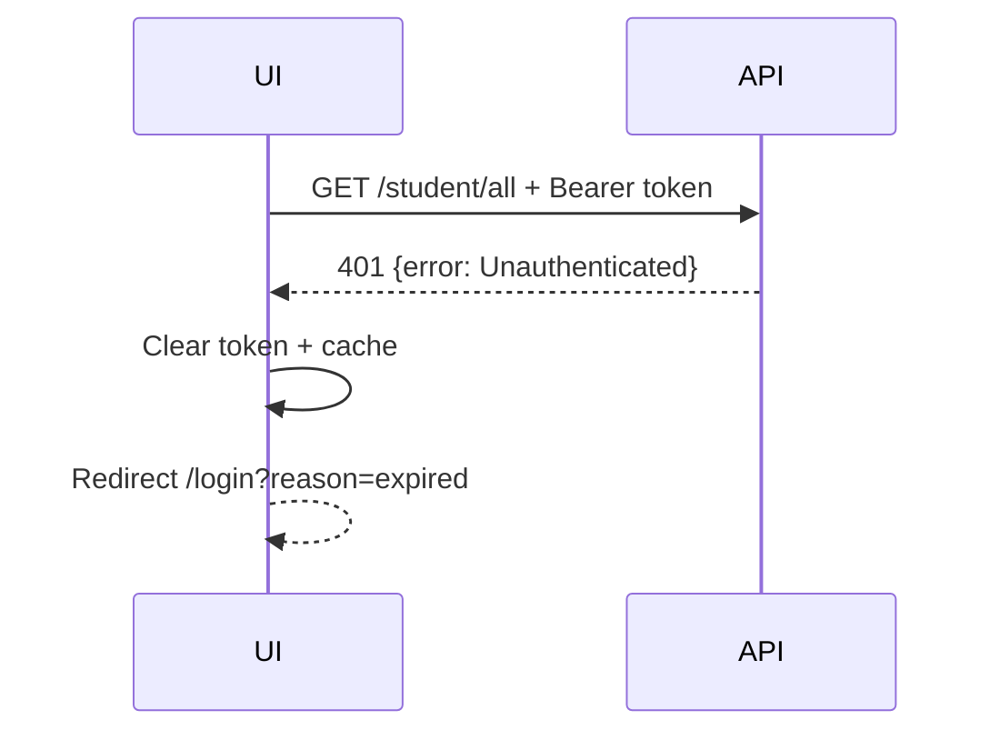

# Auth — Đặc tả frontend

**Phụ trách:** Frontend team  
**Trạng thái:** Backend-aligned  
**Cập nhật lần cuối:** 2026-07-22

## 1. Phạm vi

- Form username/password.
- Gọi `POST /authenticate`.
- Lưu JWT cho phiên demo.
- Gắn JWT vào protected request.
- Route guard.
- Xử lý 401.
- Logout phía client.

Không thuộc phạm vi hiện tại:

- Registration.
- User profile/current-user API.
- Role/permission.
- Refresh token.
- Server-side logout/revocation.
- Remember me dài hạn.

## 2. API contract

```http
POST /authenticate
Content-Type: application/json
```

```json
{
  "username": "username",
  "password": "password"
}
```

Success:

```json
{
  "token": "<jwt>"
}
```

JWT có subject là username và thời hạn 24 giờ. Error credentials chưa có response model ổn định.

## 3. UI behavior

### Login

- Hai field bắt buộc: Username, Password.
- Disable nút Login khi đang submit.
- Không ghi password hoặc token vào log.
- Thành công: lưu token và username hiển thị, chuyển Dashboard.
- Thất bại: hiển thị thông báo chung “Tên đăng nhập hoặc mật khẩu không đúng” khi status/error xác định được; với lỗi không chuẩn hóa dùng “Đăng nhập thất bại”.

### Token storage

Cho môi trường demo:

- Auth store trong memory.
- Mirror token vào `sessionStorage` để giữ phiên khi refresh tab.
- Không dùng `localStorage` cho persistent login mặc định.
- Xóa token khi logout hoặc nhận 401.

Giải pháp này vẫn có rủi ro XSS và không thay thế HttpOnly cookie trong production.

### Route guard

Guard chỉ kiểm tra token presence trước khi vào route. Token thật sự được server xác minh ở protected request đầu tiên.

### Logout

Backend không có endpoint logout. Action Logout:

1. Xóa token và username khỏi store/sessionStorage.
2. Clear toàn bộ domain query cache.
3. Chuyển `/login`.
4. Không hiển thị thông báo “token đã bị thu hồi”.

## 4. 401 flow



## 5. Acceptance criteria

| AC ID | Tiêu chí | Trạng thái |
| --- | --- | --- |
| AC-AUTH-FE-01 | Login form gửi đúng username/password | ready |
| AC-AUTH-FE-02 | Login thành công lưu non-empty token và chuyển Dashboard | ready |
| AC-AUTH-FE-03 | Login không lưu password | ready |
| AC-AUTH-FE-04 | Token được restore từ sessionStorage khi refresh | ready |
| AC-AUTH-FE-05 | Protected request có Bearer token | ready |
| AC-AUTH-FE-06 | 401 xóa auth/domain state và chuyển login | ready |
| AC-AUTH-FE-07 | Logout chỉ là client-side cleanup | ready |
| AC-AUTH-FE-08 | Invalid credentials hiển thị lỗi an toàn dù backend chưa chuẩn hóa | partial |
| AC-AUTH-FE-09 | Không render chức năng role/permission không tồn tại | ready |
