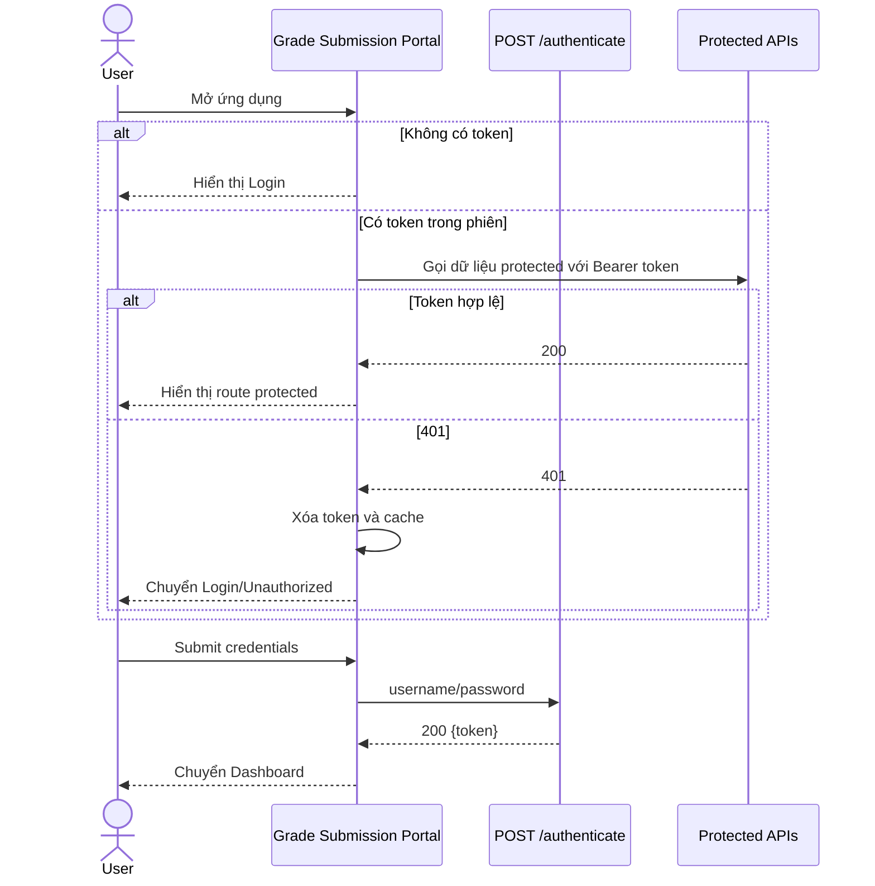

# Grade Submission — Đặc tả

**Phụ trách:** Frontend team  
**Trạng thái:** Wireframe-aligned  
**Cập nhật lần cuối:** 2026-07-22

## 1. Phạm vi

Module Grade Submission đặc tả Vue 3 SPA cấp ứng dụng cho hệ thống quản lý điểm, gồm các màn hình:

1. Login.
2. Dashboard sau đăng nhập.
3. Student Management.
4. Add Student; edit chỉ mở khi backend hỗ trợ.
5. Course Management.
6. Add Course; edit chỉ mở khi backend hỗ trợ.
7. Grade Management.
8. Submit / Update Grade.
9. Student Detail.
10. Course Detail.
11. 401 Unauthorized.
12. Confirm Delete.

## 2. Ranh giới trách nhiệm

Frontend chịu trách nhiệm:

- Điều hướng và app shell.
- Lưu trạng thái JWT cho phiên demo.
- Gắn Bearer token vào protected request.
- Chuyển entity backend thành view model.
- Tạo search, filter và pagination phía client cho dataset nhỏ.
- Hiển thị loading, empty, error và confirmation states.
- Ẩn/disable action chưa được backend hỗ trợ.

Backend chịu trách nhiệm:

- Xác thực credentials và ký JWT.
- Bảo vệ endpoint nghiệp vụ.
- Persistence của Student, Course và Grade.
- Unique course code và unique grade pair ở database.
- Trả 404 cho các custom not-found path đã triển khai.

## 3. Route map đề xuất

| Route | Màn hình | Auth |
| --- | --- | --- |
| `/login` | Login | Public |
| `/app/dashboard` | Dashboard | Required |
| `/app/students` | Student Management | Required |
| `/app/students/new` | Add Student | Required |
| `/app/students/:id` | Student Detail | Required |
| `/app/courses` | Course Management | Required |
| `/app/courses/new` | Add Course | Required |
| `/app/courses/:id` | Course Detail | Required |
| `/app/grades` | Grade Management | Required |
| `/app/grades/new` | Submit Grade | Required |
| `/app/grades/:studentId/:courseId` | Update Grade | Required |
| `/unauthorized` | 401 Unauthorized | Public |

Không đăng ký route edit Student/Course ở MVP, hoặc route phải render trạng thái “Not supported by current API”.

## 4. Global app shell

Sau đăng nhập, app shell hiển thị:

- Tên hệ thống.
- Lời chào theo username đã dùng để login.
- Menu Dashboard, Students, Courses và Grades.
- Logout.
- Khu vực nội dung của route hiện tại.

Navigation active state phải dựa trên route hiện tại. Logout chỉ xóa token phía client vì backend không có logout/revocation endpoint.

## 5. Bootstrap flow

Backend không có endpoint `GET current user`; portal chỉ có thể giữ username từ form đăng nhập để hiển thị lời chào trong phiên hiện tại.

## 6. API dependency

Module Grade Submission kế thừa toàn bộ quy tắc tại [../platform/spec.md](../platform/spec.md), và phụ thuộc vào:

- [Auth](../auth/spec.md)
- [Dashboard](../dashboard/spec.md)
- [Students](../students/spec.md)
- [Courses](../courses/spec.md)
- [Grades](../grades/spec.md)

## 7. Global states

### Loading

- Giữ layout ổn định.
- Disable action có thể gửi trùng.
- Table dùng skeleton hoặc loading row.

### Empty

- Nêu rõ không có dữ liệu hay không có kết quả lọc.
- Cung cấp action thêm mới khi backend hỗ trợ.

### 401

- Xóa token và cache domain.
- Không tự động retry vô hạn.
- Chuyển tới login hoặc màn hình 401.

### 404

- Hiển thị resource not found và nút quay về danh sách.

### Unknown 4xx/5xx

- Chuẩn hóa thông báo qua Platform error adapter.
- Không hiển thị stack trace hoặc raw SQL message.

## 8. Acceptance criteria

| AC ID | Tiêu chí | Trạng thái |
| --- | --- | --- |
| AC-GS-01 | Người chưa có token chỉ truy cập được login/public error page | ready |
| AC-GS-02 | Route protected gửi Bearer token qua API client chung | ready |
| AC-GS-03 | App shell hiển thị đúng menu và active route | ready |
| AC-GS-04 | 401 xóa token/cache và chuyển về login an toàn | ready |
| AC-GS-05 | Logout xóa client state và không tuyên bố revoke token server | ready |
| AC-GS-06 | Mọi màn hình có loading, empty và error state | ready |
| AC-GS-07 | Edit Student/Course không gọi API giả hoặc delete-create workaround | ready |
| AC-GS-08 | Mọi field Student dùng `birthDate` trong view model chuẩn | ready |
| AC-GS-09 | Mọi grade giữ nguyên kiểu chuỗi | ready |
| AC-GS-10 | Portal hoạt động qua same-origin reverse proxy hoặc dev proxy | partial |
