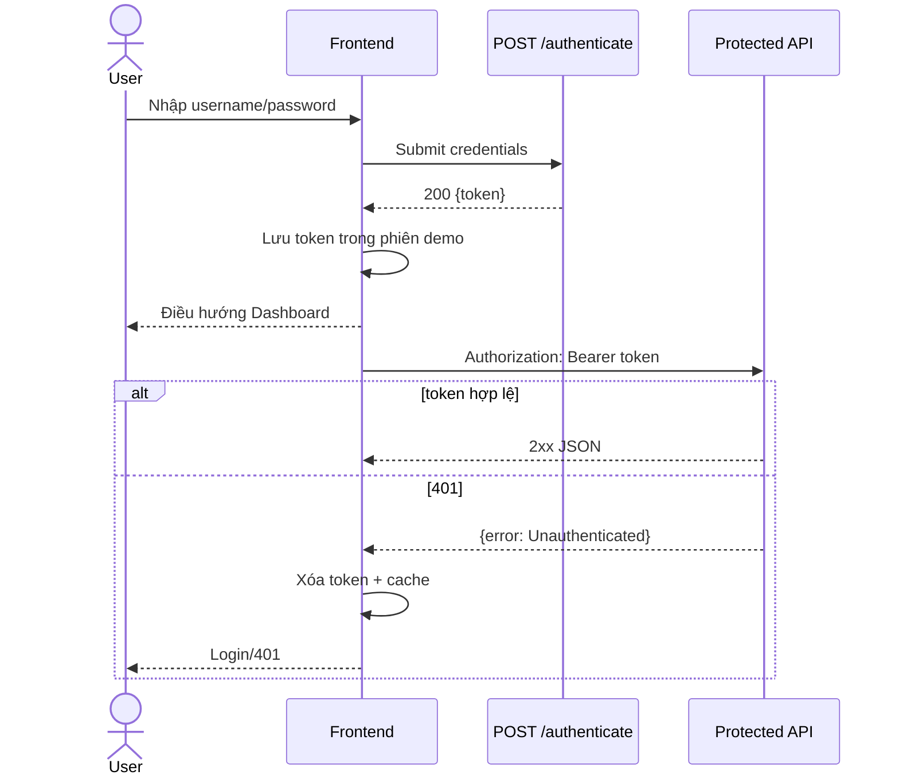

# Đặc tả — Grade Submission Frontend

**Phụ trách:** Frontend team  
**Trạng thái:** Specification-ready; source verification pending  
**Cập nhật lần cuối:** 2026-07-29

## 1. Mục tiêu sản phẩm

Grade Submission Frontend là SPA cung cấp giao diện cho người dùng đăng nhập và quản lý:

- Student.
- Course.
- Grade theo cặp Student–Course.
- Dashboard tổng hợp số lượng.

Frontend giao tiếp với companion Spring Boot API bằng HTTP JSON và Bearer JWT.

## 2. Actor và quyền hiện tại

### Guest

- Truy cập `/login` và public error page.
- Không truy cập route nghiệp vụ.

### Authenticated user

- Có JWT hợp lệ.
- Truy cập Dashboard, Students, Courses và Grades.
- Backend hiện không có role/permission; mọi JWT hợp lệ có cùng quyền.

## 3. Route map

| Route | Màn hình | Auth | Trạng thái |
| --- | --- | --- | --- |
| `/login` | Login | Public | Ready |
| `/app/dashboard` | Dashboard | Required | Ready; activities blocked |
| `/app/students` | Student Management | Required | Ready |
| `/app/students/new` | Add Student | Required | Ready |
| `/app/students/:id` | Student Detail | Required | Ready |
| `/app/courses` | Course Management | Required | Ready |
| `/app/courses/new` | Add Course | Required | Ready |
| `/app/courses/:id` | Course Detail | Required | Ready |
| `/app/grades` | Grade Management | Required | Ready |
| `/app/grades/new` | Submit Grade | Required | Ready |
| `/app/grades/:studentId/:courseId` | Update Grade | Required | Ready |
| `/unauthorized` | 401 Unauthorized | Public | Ready |
| `*` | Not Found | Public/Protected | Frontend-proposed |

Không đăng ký happy-path edit route cho Student/Course cho đến khi backend có `PUT/PATCH` tương ứng.

## 4. App shell

Sau đăng nhập, layout hiển thị:

- Tên **GRADE SUBMISSION SYSTEM**.
- Lời chào theo username trong phiên.
- Navigation: Dashboard, Students, Courses, Grades.
- Logout.
- Vùng nội dung route hiện tại.

Active navigation phải lấy từ router state. Logout chỉ xóa JWT, username và cache phía client; không được mô tả là revoke token server.

## 5. Authentication flow



Backend hiện không có `/me`, refresh token, revoke hoặc logout endpoint. Greeting dùng username đã nhập hoặc JWT subject nếu decoder an toàn.

## 6. API contract

Base URL local: `http://localhost:9090`.

### Authentication

| Method | Path | Success |
| --- | --- | --- |
| `POST` | `/authenticate` | `200 {"token":"..."}` |

### Student

| Method | Path | UI usage |
| --- | --- | --- |
| `GET` | `/student/all` | List, dashboard count, selectors |
| `GET` | `/student/{id}` | Student Detail |
| `POST` | `/student` | Add Student |
| `DELETE` | `/student/{id}` | Delete Student |

Create payload:

```json
{
  "name": "Nguyễn Văn A",
  "birthDate": "2003-07-31"
}
```

### Course

| Method | Path | UI usage |
| --- | --- | --- |
| `GET` | `/course/all` | List, dashboard count, selectors |
| `GET` | `/course/{id}` | Course Detail |
| `POST` | `/course` | Add Course |
| `DELETE` | `/course/{id}` | Delete Course |

Create payload:

```json
{
  "subject": "Java Programming",
  "code": "JAVA101",
  "description": "Basic Java programming course"
}
```

`Course Name` trên UI ánh xạ sang `subject` trong API.

### Grade

| Method | Path | UI usage |
| --- | --- | --- |
| `GET` | `/grade/all` | List, dashboard count |
| `GET` | `/grade/student/{studentId}` | Student Detail/filter |
| `GET` | `/grade/course/{courseId}` | Course Detail/filter |
| `GET` | `/grade/student/{studentId}/course/{courseId}` | Grade lookup |
| `POST` | `/grade/student/{studentId}/course/{courseId}` | Create Grade |
| `PUT` | `/grade/student/{studentId}/course/{courseId}` | Update Grade |
| `DELETE` | `/grade/student/{studentId}/course/{courseId}` | Delete Grade |

Payload:

```json
{ "score": "8.5" }
```

`score` luôn được giữ dưới dạng chuỗi; không ép `8.5` thành number nếu contract chưa thay đổi.

## 7. Data mapping

| UI model | Backend field | Quy tắc |
| --- | --- | --- |
| `student.fullName` hoặc `name` | `name` | Chọn một canonical view-model field trong source |
| `student.birthDate` | `birthDate` | API `yyyy-MM-dd`, UI có thể hiển thị `yyyy/MM/dd` |
| `course.name` | `subject` | Mapper chịu trách nhiệm đổi tên |
| `course.code` | `code` | Giữ nguyên |
| `grade.score` | `score` | String |
| `grade.studentId` | `student.id` | Flatten cho view model nếu cần |
| `grade.courseId` | `course.id` | Flatten cho view model nếu cần |

## 8. Hành vi theo màn hình

### Dashboard

- Gọi ba list endpoint độc lập.
- Total Students/Courses/Grades là độ dài collection.
- Mỗi card có loading/error riêng hoặc có degraded-state rõ ràng.
- Recent Activities không được dùng dữ liệu giả như dữ liệu backend thật.

### Students và Courses

- Search/pagination phía client trên `/all`.
- Create và detail được hỗ trợ.
- Delete phải có Confirm Delete và cảnh báo ảnh hưởng Grade.
- Edit action phải ẩn/disable; không dùng delete-create workaround.

### Grades

- Filter theo Student/Course.
- Create, update và delete theo cặp ID.
- Duplicate pair phải hiển thị lỗi an toàn dù backend error contract chưa ổn định.

## 9. Global UI states

- **Loading:** giữ layout ổn định, disable double submit.
- **Empty:** phân biệt collection rỗng và không có kết quả lọc.
- **401:** clear auth/cache, chuyển Login/Unauthorized, không retry vô hạn.
- **404:** resource-not-found và CTA quay về danh sách.
- **409/constraint:** không báo success, không rò SQL/stack trace.
- **5xx/network:** giữ input khi an toàn và cho retry.
- **204:** không gọi `response.json()`.

## 10. Product-level acceptance criteria

| AC ID | Tiêu chí | Trạng thái |
| --- | --- | --- |
| `AC-PROD-01` | Guest không truy cập route protected | Ready |
| `AC-PROD-02` | Login hợp lệ lưu JWT và chuyển Dashboard | Ready |
| `AC-PROD-03` | Protected request dùng Bearer token qua API client chung | Ready |
| `AC-PROD-04` | 401 xóa token/cache và đưa người dùng về auth surface | Ready |
| `AC-PROD-05` | App shell hiển thị đúng navigation và active route | Ready |
| `AC-PROD-06` | Dashboard hiển thị ba count từ API hiện tại | Ready/Partial |
| `AC-PROD-07` | Student dùng `birthDate` nhất quán | Ready |
| `AC-PROD-08` | Course Name được map từ `subject` | Ready |
| `AC-PROD-09` | Grade score giữ kiểu string | Ready |
| `AC-PROD-10` | Create/detail/delete Student và Course hoạt động đúng contract | Ready |
| `AC-PROD-11` | Create/update/delete Grade hoạt động theo cặp Student–Course | Ready |
| `AC-PROD-12` | Unsupported Edit Student/Course không gửi request giả | Ready |
| `AC-PROD-13` | Mọi màn hình có loading/empty/error states | Frontend-proposed |
| `AC-PROD-14` | Frontend hoạt động qua dev proxy hoặc same-origin deployment | Partial |
| `AC-PROD-15` | UI đáp ứng keyboard, label và responsive baseline | Frontend-proposed |

## 11. Ràng buộc và backlog

- H2 in-memory mất dữ liệu khi backend restart.
- API list không pagination/search server-side.
- Error body chưa đồng nhất.
- Invalid credentials hoặc duplicate constraint có thể chưa trả status mong muốn.
- Không có health endpoint, activity API, update Student/Course hoặc RBAC.
- Frontend khác origin cần proxy hoặc backend CORS allowlist.
