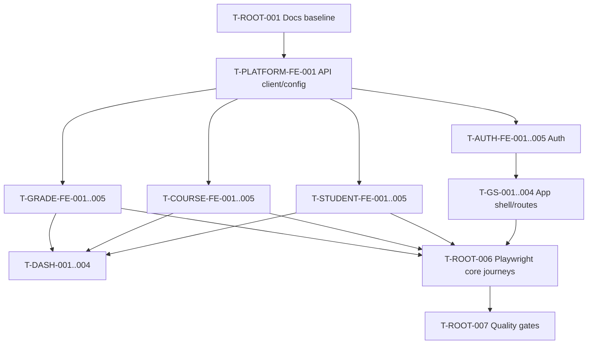

# Tasks — Grade Submission Frontend Product Index

**Phụ trách:** Frontend team  
**Trạng thái:** Specification-ready; execution status must be verified from source  
**Cập nhật lần cuối:** 2026-07-29

## 1. Cách dùng

File này là chỉ mục tác nghiệp cấp sản phẩm. Chi tiết task nằm trong `docs/modules/<module>/tasks.md`.

- `ready`: backend contract cho phép triển khai.
- `partial`: cần chốt error/CORS/deployment hoặc source evidence.
- `blocked`: backend chưa có capability.
- `backlog`: ngoài MVP.
- Không đổi task sang `done` nếu chưa có source, test và review evidence.

## 2. Dependency map

## 3. Root tasks

| Task ID | Công việc | Dependency | Output/Evidence mục tiêu | Trạng thái |
| --- | --- | --- | --- | --- |
| `T-ROOT-001` | Đưa bộ docs vào repository và sửa link | — | `docs/` link-check pass | ready |
| `T-ROOT-002` | Tạo frontend scaffold theo architecture | 001 | `src/app`, `src/core`, `src/features`, `src/shared` | ready |
| `T-ROOT-003` | Chốt package scripts và env validation | 002 | `package.json`, `.env.example`, config tests | ready |
| `T-ROOT-004` | Tích hợp tất cả screen docs vào router | Auth/App modules | route/component source | ready |
| `T-ROOT-005` | Bổ sung accessibility/responsive baseline | 004 | component tests + manual review | ready |
| `T-ROOT-006` | Tạo Playwright project và core journeys | 003,004 | `e2e/**/*.spec.ts`, report | ready |
| `T-ROOT-007` | Thiết lập lint/typecheck/test/build/E2E gates | 003,006 | CI hoặc local gate script | ready |
| `T-ROOT-008` | Tạo deployment same-origin hoặc proxy | 003 | reverse proxy/dev proxy config | partial |
| `T-ROOT-009` | Thêm release checklist và artifact retention | 007,008 | runbook evidence | backlog |

## 4. Module task index

| Module | Canonical task file | Các task chính |
| --- | --- | --- |
| Grade Submission shell | [`modules/grade_submission/tasks.md`](modules/grade_submission/tasks.md) | `T-GS-001`…`T-GS-007` |
| Platform | [`modules/platform/tasks.md`](modules/platform/tasks.md) | API client, mapper, paging, cache, feedback, proxy |
| Auth | [`modules/auth/tasks.md`](modules/auth/tasks.md) | Login, token store, guard, logout, error adapter |
| Dashboard | [`modules/dashboard/tasks.md`](modules/dashboard/tasks.md) | Counts, partial states, invalidation, activities gap |
| Students | [`modules/students/tasks.md`](modules/students/tasks.md) | List, create, detail, delete, unsupported edit |
| Courses | [`modules/courses/tasks.md`](modules/courses/tasks.md) | List, create, detail, delete, duplicate handling |
| Grades | [`modules/grades/tasks.md`](modules/grades/tasks.md) | List/filter, create, update, delete, invalidation |

## 5. MVP implementation order

### Phase 1 — Foundations

- `T-ROOT-001`…`003`.
- `T-PLATFORM-FE-001`…`005`.
- Shared components: Loading, Empty, Error, Confirm Dialog, Pagination.

### Phase 2 — Auth và shell

- `T-AUTH-FE-001`…`005`.
- `T-GS-001`…`004`.
- 401 handling và client logout.

### Phase 3 — Domain features

- Students.
- Courses.
- Grades.
- Dashboard counts và cache invalidation.

### Phase 4 — Quality

- Unit/component/integration tests.
- Core Playwright journeys.
- Accessibility, responsive, bundle budget.
- Build and deployment verification.

## 6. Backend-dependent tasks

| Task | Lý do | Frontend behavior trước khi hoàn thành |
| --- | --- | --- |
| `T-STUDENT-BE-006` | Thiếu update Student endpoint | Ẩn/disable Edit Student |
| `T-COURSE-BE-007` | Thiếu update Course endpoint | Ẩn/disable Edit Course |
| `T-DASH-005` | Thiếu activity API | Hidden/Unavailable state |
| `T-COURSE-BE-006` | Duplicate-code error chưa ổn định | Generic safe conflict error |
| `T-GRADE-BE-006` | Duplicate-pair error chưa ổn định | Generic safe conflict error |
| Server pagination/search | List API chỉ trả toàn bộ | Client-side search/pagination |
| Logout/revocation | JWT stateless, không endpoint | Client cleanup only |

## 7. Definition of Done cho task frontend

Một task chỉ được chuyển sang Done khi:

- Có AC reference.
- Source được review.
- Loading/empty/error state được xử lý.
- Không gọi endpoint không tồn tại.
- Có unit/component/integration test phù hợp.
- E2E được cập nhật nếu hành trình người dùng thay đổi.
- Lint, typecheck, test và build pass.
- Docs và traceability được cập nhật.
- Không log password hoặc JWT.
